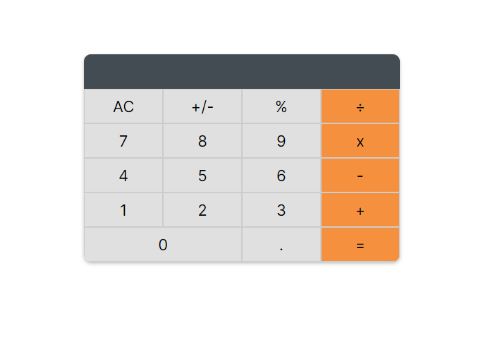

# Math Magician

> A basic calculator built with react that solves simple arithmetic problems with basic operators.

## Built With

- ReactJs and CSS3.
- React app setup.
- Webpack, jest, and babel.

## Live Demo

[Live Demo Link](https://promzzykoncepts.github.io/Math-Magician/)

.

## Getting Started

To get a local copy up and running follow these simple example steps.

### Prerequisites

Node.js

### Setup

To get a local copy up and running you'll need to have [NodeJS](https://nodejs.org/en/download/) installed on your local machine.

### Install

After installing NodeJS please follow the next steps...

### Usage

```bash

npm i

```

-- for installing dev dependecies.

```bash

npm run build

```

-- to run the project.

### Testing

```bash

npm run start

```

### Deployment

```bash

npm run deploy

```

## Authors

👤 **PROMISE OKECHUKWU**

- GitHub: [@promzzykoncepts](https://github.com/PromzzyKoncepts)
- Twitter: [@promzzy](https://twitter.com/prOmzzy)
- LinkedIn: [promiseokechukwu](https://linkedin.com/in/promiseokechukwu)

## 🤝 Contributing

Contributions, issues, and feature requests are welcome!

Feel free to check the [issues page](../../issues/).

## Show your support

Give a ⭐️ if you like this project!

## Acknowledgments

- You for viewing this repo and dropping a ⭐️.
- Microverse for their Calculate and Operate.js files.
- etc

## 📝 License

This project is [MIT](./LICENSE) licensed.
